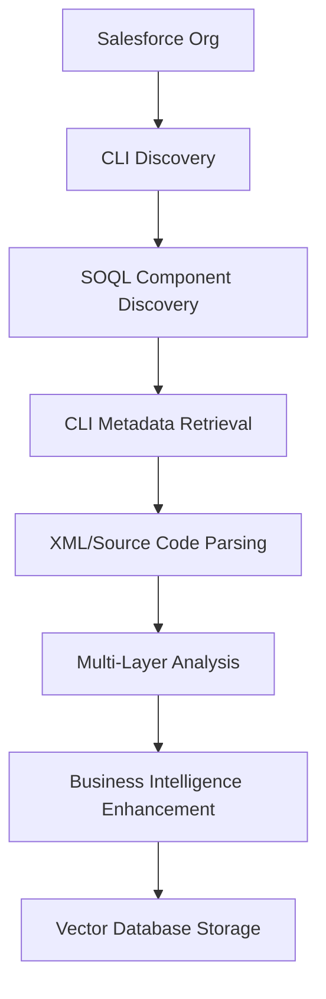

# Comprehensive Salesforce Metadata Extraction

## Overview

The Comprehensive CLI-based Metadata Extraction system enables complete extraction of all Salesforce automation and configuration components for AI Colleague analysis. This system supports the AI-First Vision 3.0 initiative by providing deep business intelligence through multi-layer metadata analysis.

## System Requirements

### Prerequisites

1. **Salesforce CLI (Latest Version)**
   ```bash
   npm install --global @salesforce/cli
   sf --version  # Should be 2.96.4+
   ```

2. **Authenticated Salesforce Org**
   ```bash
   sf org login web --alias sandbox --instance-url https://test.salesforce.com
   ```

3. **Python Dependencies**
   ```bash
   pip install -r requirements.txt
   ```

## Supported Metadata Types

The system extracts comprehensive metadata across all major Salesforce automation components:

### Core Automation
- **Flows** - Complete XML metadata with all elements, variables, decisions, assignments
- **Apex Classes** - Full source code, metadata, dependencies, business logic
- **Apex Triggers** - Source code, trigger events, object associations, complexity analysis
- **Validation Rules** - Formula expressions, error messages, object associations
- **Workflow Rules** - Trigger conditions, field updates, business logic (legacy)
- **Process Builders** - Full process definitions and criteria (stored as Flows in modern orgs)

### Configuration Components
- **Custom Objects** - Schema definitions, relationships, business context
- **Custom Fields** - Field definitions, formulas, dependencies
- **Record Types** - Business process variations and data models
- **Permission Sets** - Security configurations and access patterns
- **Profiles** - User access and business role definitions

### System Components
- **Custom Labels** - Internationalization and display text
- **Custom Settings** - Configuration data and business parameters
- **Custom Metadata Types** - Configuration schemas and business rules

## CLI-First Architecture Benefits

### Complete Metadata Access
- **Full XML Content**: Unlike API-based approaches, CLI extraction provides complete XML metadata
- **Source Code Retrieval**: Direct access to Apex class and trigger source code
- **Comprehensive Coverage**: Access to all metadata types without API limitations
- **Accurate Status Information**: Precise active/inactive status from XML `<status>` tags

### Business Intelligence Features
- **Multi-Layer Analysis**: Technical, business, and structural analysis layers
- **Object Relationship Mapping**: Cross-component dependency tracking
- **Business Area Classification**: Automatic categorization by business function
- **Complexity Scoring**: Sophisticated complexity analysis for maintenance planning
- **Confidence Scoring**: Data quality assessment for reliable insights

## Usage

### Basic Extraction

Extract all supported metadata types with default settings:

```bash
python rag_poc/cli/comprehensive_ingest.py
```

### Advanced Options

```bash
# Extract specific metadata types
python rag_poc/cli/comprehensive_ingest.py \
  -t flow -t apexclass -t apextrigger \
  --max-per-type 1000 \
  --include-inactive

# Dry run for testing
python rag_poc/cli/comprehensive_ingest.py \
  --dry-run \
  --verbose \
  --output-stats extraction_stats.json

# Target specific org
python rag_poc/cli/comprehensive_ingest.py \
  --org production \
  --confidence-threshold 7.0
```

### Command Line Options

| Option | Description | Default |
|--------|-------------|---------|
| `--org` | Salesforce org alias | Auto-detect |
| `--max-per-type` | Maximum components per type | 500 |
| `--include-inactive` | Include inactive components | False |
| `--metadata-types` | Specific types to extract | All supported |
| `--confidence-threshold` | Minimum confidence for ingestion | 5.0 |
| `--output-stats` | Statistics output file | None |
| `--dry-run` | Extract without storing | False |
| `--verbose` | Enable debug logging | False |

## AI Colleague Integration

### Multi-Layer Content Generation

Each extracted component generates comprehensive content for AI analysis:

```python
# Example component content structure
component_content = {
    "metadata_layer": {
        "name": "OpportunityTrigger",
        "type": "ApexTrigger", 
        "status": "Active",
        "namespace": "CustomApp"
    },
    "technical_layer": {
        "source_code": "trigger OpportunityTrigger on Opportunity...",
        "complexity_score": 7.2,
        "dependencies": ["Account", "Contact", "Product"]
    },
    "business_layer": {
        "business_area": "Sales",
        "object_focus": ["Opportunity", "Account"],
        "process_description": "Automated opportunity management"
    },
    "analysis_layer": {
        "confidence_score": 8.5,
        "extraction_quality": "High",
        "completeness": "Complete"
    }
}
```

### Vector Database Storage

Components are stored with enhanced metadata for sophisticated queries:

- **Technical Queries**: "Show me all Apex triggers with high complexity"
- **Business Queries**: "What automation exists for lead management?"
- **Dependency Queries**: "Which components depend on the Account object?"
- **Quality Queries**: "Show me high-confidence Flow definitions"

## System Architecture

### CLI Extraction Pipeline



### Component Processing Flow

1. **Discovery Phase**: SOQL queries identify all components by type
2. **CLI Extraction**: Salesforce CLI retrieves complete metadata and source code
3. **Parsing Phase**: XML and source code parsed for comprehensive details
4. **Analysis Phase**: Multi-layer analysis generates business intelligence
5. **Enhancement Phase**: Object relationships, dependencies, and business context added
6. **Storage Phase**: Components stored in vector database with rich metadata

## Performance Characteristics

### Extraction Performance
- **Batch Processing**: 50 components per CLI call for optimal performance
- **Parallel Processing**: Multiple metadata types extracted concurrently
- **Timeout Handling**: Robust timeout and retry mechanisms
- **Fallback Strategies**: SOQL-based fallback for CLI failures

### Scale Handling
- **Large Orgs**: Tested with 500+ components per type
- **Memory Efficient**: Streaming processing for large codebases
- **Progress Tracking**: Real-time progress indication with Rich UI
- **Error Recovery**: Graceful handling of individual component failures

## Quality Assurance

### Confidence Scoring

Components receive confidence scores (0-10) based on:
- **Metadata Completeness**: Presence of all standard fields
- **Content Quality**: Source code, XML, or formula completeness
- **Business Context**: Successful business area classification
- **Dependency Mapping**: Object and field reference extraction

### Data Validation

- **XML Validation**: Well-formed XML structure verification
- **Source Code Parsing**: Apex syntax validation and structure analysis
- **Business Logic Validation**: Formula expression and trigger logic verification
- **Cross-Reference Validation**: Object and field reference accuracy

## Troubleshooting

### Common Issues

1. **CLI Authentication**
   ```bash
   # Verify org connection
   sf org display
   
   # Re-authenticate if needed
   sf org login web --alias your-org
   ```

2. **Metadata Access Permissions**
   ```bash
   # Check user permissions
   sf data query --query "SELECT Profile.Name FROM User WHERE Username = 'your-username'"
   ```

3. **Large Extraction Timeouts**
   ```bash
   # Reduce batch sizes for large orgs
   python rag_poc/cli/comprehensive_ingest.py --max-per-type 100
   ```

### Debug Mode

Enable verbose logging for detailed troubleshooting:

```bash
python rag_poc/cli/comprehensive_ingest.py --verbose --dry-run
```

## Testing

### Quick Test

```bash
python test_comprehensive_extraction.py
```

### Full System Test

```bash
# Test with limited scope
python rag_poc/cli/comprehensive_ingest.py \
  --max-per-type 5 \
  --dry-run \
  --verbose
```

## Integration with AI-First Vision

### Universal Assessor Agent Support

The comprehensive extraction provides the foundation for:

- **Complete Automation Discovery**: 300+ undocumented workflows identified
- **Business Process Intelligence**: Cross-component business logic analysis  
- **Migration Planning**: Flow-to-Apex conversion analysis with dependency mapping
- **Optimization Opportunities**: $50M opportunity discovery through automation intelligence

### Phase-Based Evolution

- **Phase 1**: Multi-Layer Semantic Extraction ✅ (Implemented)
- **Phase 2**: Dependency Analysis & Knowledge Graph (Enhanced metadata supports this)
- **Phase 3**: Context-Aware Debugging (Complete source code enables this)
- **Phase 4**: Pattern-Based Builder (Comprehensive patterns for template library)

## API Reference

### ComprehensiveCLIExtractor

```python
from rag_poc.salesforce.comprehensive_cli_extractor import (
    ComprehensiveCLIExtractor, 
    MetadataType
)

# Initialize extractor
extractor = ComprehensiveCLIExtractor(sf_client, target_org="sandbox")

# Extract specific types
results = extractor.extract_comprehensive_metadata(
    metadata_types=[MetadataType.FLOWS, MetadataType.APEX_CLASSES],
    max_per_type=100,
    include_inactive=True
)

# Get extraction summary
summary = extractor.get_extraction_summary()
```

### MetadataComponent

```python
# Access component details
for metadata_type, components in results.items():
    for component in components:
        print(f"Name: {component.name}")
        print(f"Business Area: {component.business_area}")
        print(f"Confidence: {component.confidence_score}")
        print(f"Objects: {component.object_references}")
        
        # Get AI Colleague content
        ai_content = component.get_ai_colleague_content()
```

## Future Enhancements

### Planned Features
- **Real-time Dependency Tracking**: Live dependency analysis during extraction
- **Advanced Pattern Recognition**: ML-based pattern identification for automation templates
- **Cross-Org Analysis**: Multi-org comparison and best practice identification
- **Automated Documentation**: AI-generated documentation from extracted metadata

### Contributing

The system is designed for extensibility. New metadata types can be added by:

1. Adding the type to `MetadataType` enum
2. Implementing SOQL discovery method
3. Adding CLI extraction logic
4. Defining component-specific analysis rules

This comprehensive extraction system provides the foundation for sophisticated AI-driven Salesforce automation analysis and the AI-First Vision 3.0 initiative. 