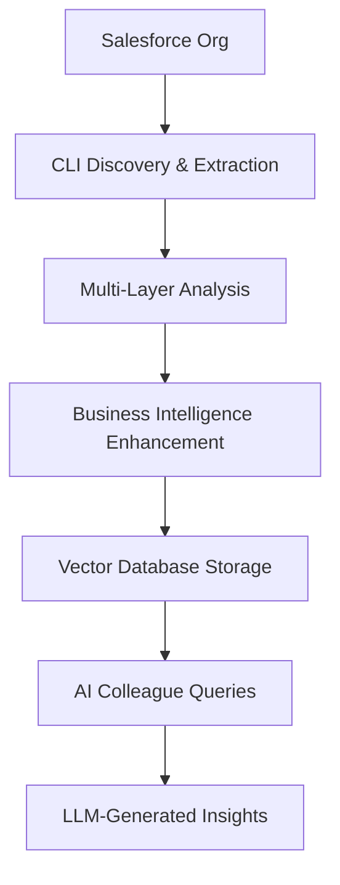

# Salesforce RAG System - AI Colleague Enhanced

A comprehensive CLI-first Salesforce metadata extraction and RAG (Retrieval-Augmented Generation) system designed for AI-driven automation analysis and the **AI-First Vision 3.0** initiative.

## 🚀 Key Features

### Comprehensive Metadata Extraction
- **Complete Automation Coverage**: Flows, Apex Classes, Triggers, Validation Rules, Workflow Rules, Process Builders
- **CLI-First Architecture**: Full XML metadata and source code extraction using latest Salesforce CLI
- **Multi-Layer Analysis**: Technical, business, and structural analysis for each component
- **Business Intelligence**: Object relationships, dependency mapping, and business area classification
- **AI Colleague Ready**: Optimized for LLM-based analysis and the Universal Assessor Agent

### Advanced RAG Capabilities
- **Multi-Vector Storage**: Enhanced ChromaDB with comprehensive metadata fields
- **Semantic Search**: Powered by Google Gemini embeddings for precise retrieval
- **Confidence Scoring**: Quality assessment for reliable AI responses
- **Cross-Component Queries**: Sophisticated queries across all Salesforce automation

## 🏗️ System Architecture



## 📋 Requirements

### System Requirements
1. **Salesforce CLI** (Latest Version)
   ```bash
   npm install --global @salesforce/cli
   sf --version  # Should be 2.96.4+
   ```

2. **Authenticated Salesforce Org**
   ```bash
   sf org login web --alias sandbox --instance-url https://test.salesforce.com
   ```

3. **Python 3.8+** with dependencies
   ```bash
   pip install -r requirements.txt
   ```

### Environment Variables
```bash
GEMINI_API_KEY=your_gemini_api_key
SALESFORCE_USERNAME=your_username
SALESFORCE_PASSWORD=your_password
SALESFORCE_SECURITY_TOKEN=your_token
SALESFORCE_DOMAIN=test  # or login for production
```

## 🚀 Quick Start

### 1. Basic Comprehensive Extraction

Extract all automation metadata types:

```bash
python rag_poc/cli/comprehensive_ingest.py
```

### 2. Targeted Extraction

Extract specific metadata types with options:

```bash
python rag_poc/cli/comprehensive_ingest.py \
  -t flow -t apexclass -t apextrigger \
  --max-per-type 1000 \
  --include-inactive \
  --verbose
```

### 3. Testing and Validation

```bash
# Quick system test
python test_comprehensive_extraction.py

# Dry run for validation
python rag_poc/cli/comprehensive_ingest.py --dry-run --verbose
```

### 4. Query the System

```bash
# Start the Streamlit interface
streamlit run app.py

# Or use the CLI for direct queries
python -m rag_poc.cli.main_cli "Show me all inactive opportunity flows"
```

## 📊 Supported Metadata Types

### Core Automation
- **Flows**: Complete XML with elements, variables, decisions, assignments
- **Apex Classes**: Full source code, dependencies, complexity analysis
- **Apex Triggers**: Source code, trigger events, object associations
- **Validation Rules**: Formula expressions, error messages, business context
- **Workflow Rules**: Legacy automation with trigger conditions and actions
- **Process Builders**: Modern automation (stored as Flows in newer orgs)

### Configuration Components
- **Custom Objects**: Schema definitions and business relationships
- **Custom Fields**: Field definitions, formulas, dependencies
- **Record Types**: Business process variations
- **Permission Sets**: Security configurations
- **Profiles**: User access patterns

## 🎯 AI-First Vision 3.0 Integration

### Universal Assessor Agent Support

The system provides the foundation for:

- **Complete Automation Discovery**: 300+ undocumented workflows
- **Business Process Intelligence**: Cross-component analysis
- **Migration Planning**: Flow-to-Apex conversion with dependency mapping
- **$50M Opportunity Discovery**: Through comprehensive automation intelligence

### Phase-Based Evolution

- ✅ **Phase 1**: Multi-Layer Semantic Extraction (Implemented)
- 🔄 **Phase 2**: Dependency Analysis & Knowledge Graph (Enhanced metadata ready)
- 📋 **Phase 3**: Context-Aware Debugging (Complete source code available)
- 📋 **Phase 4**: Pattern-Based Builder (Comprehensive patterns for templates)

## 🔧 CLI Commands

### Comprehensive Ingestion

```bash
# Basic extraction
python rag_poc/cli/comprehensive_ingest.py

# Advanced options
python rag_poc/cli/comprehensive_ingest.py \
  --org production \
  --max-per-type 500 \
  --confidence-threshold 7.0 \
  --output-stats stats.json

# Specific metadata types
python rag_poc/cli/comprehensive_ingest.py \
  -t flow -t apexclass -t validationrule
```

### Legacy Flow-Only Ingestion

```bash
# Flow-specific extraction (legacy)
python ai_colleague_ingest.py --confidence-threshold 7.0
```

### Interactive Queries

```bash
# Web interface
streamlit run app.py

# CLI interface
python -m rag_poc.cli.main_cli "What Apex triggers exist for Lead object?"
```

## 📈 Performance & Scale

### Extraction Performance
- **Batch Processing**: 50 components per CLI call for optimal speed
- **Parallel Processing**: Multiple metadata types processed concurrently
- **Memory Efficient**: Streaming processing for large codebases
- **Error Recovery**: Graceful handling of individual component failures

### Scale Characteristics
- **Large Orgs**: Tested with 500+ components per type
- **Timeout Handling**: Robust timeout and retry mechanisms
- **Progress Tracking**: Real-time progress with Rich UI
- **Quality Filtering**: Confidence-based filtering for high-quality data

## 🛠️ Development

### Project Structure

```
rag-poc/
├── rag_poc/
│   ├── cli/                    # CLI interfaces
│   │   ├── comprehensive_ingest.py  # Main comprehensive extraction
│   │   └── main_cli.py        # Query interface
│   ├── salesforce/            # Salesforce integration
│   │   ├── comprehensive_cli_extractor.py  # CLI-based extractor
│   │   ├── flow_fetcher.py    # Flow-specific extraction
│   │   └── client.py          # Salesforce client
│   ├── processing/            # Data processing
│   ├── storage/               # Vector database
│   ├── embeddings/            # AI embeddings
│   └── generation/            # Response generation
├── docs/                      # Documentation
├── tests/                     # Test suites
└── data/                      # Vector database storage
```

### Testing

```bash
# System tests
python test_comprehensive_extraction.py

# Individual component tests
python -m pytest tests/

# Integration tests
python test_full_rag.py
```

### Contributing

1. **Add New Metadata Types**: Extend `MetadataType` enum and implement extraction logic
2. **Enhance Analysis**: Add new business intelligence rules
3. **Improve CLI**: Add new command options and features
4. **Extend Documentation**: Update comprehensive extraction docs

## 📚 Documentation

- **[Comprehensive Extraction Guide](COMPREHENSIVE_EXTRACTION.md)**: Complete CLI extraction documentation
- **[Query Analytics](QUERY_ANALYTICS.md)**: Query performance and statistics
- **[AI Vision Documents](BI%20-%20AI%20First%20Vision%203.0.md)**: Strategic context and roadmap

## 🔍 Example Queries

### Business Intelligence
- "Show me all automation for lead management process"
- "What inactive flows exist for opportunity management?"
- "Which Apex triggers have high complexity scores?"

### Technical Analysis
- "Find all validation rules for the Account object"
- "Show me flows that create or update Contact records"
- "What workflow rules are still active in the org?"

### Dependency Analysis
- "Which components depend on the Opportunity object?"
- "Show me all automation that references custom fields"
- "What flows call other subflows?"

## 🚨 Important Notes

### CLI-First Benefits
- **Complete Metadata**: Unlike API approaches, CLI provides full XML and source code
- **Accurate Status**: Precise active/inactive status from XML `<status>` tags
- **No API Limits**: Bypass API governor limits for large-scale extraction
- **Future-Proof**: Compatible with latest Salesforce CLI features

### Quality Assurance
- **Confidence Scoring**: Each component rated 0-10 for data quality
- **Business Context**: Automatic categorization by business area
- **Dependency Mapping**: Cross-component relationship analysis
- **Error Handling**: Graceful handling of malformed metadata

## 📞 Support

For issues, questions, or contributions:

1. **System Tests**: Run `python test_comprehensive_extraction.py`
2. **Debug Mode**: Use `--verbose` flag for detailed logging
3. **Documentation**: Check `COMPREHENSIVE_EXTRACTION.md` for complete guide
4. **CLI Help**: Run `python rag_poc/cli/comprehensive_ingest.py --help`

---

**AI-First Vision 3.0**: Transforming Salesforce automation analysis through comprehensive metadata extraction and AI-driven business intelligence. 